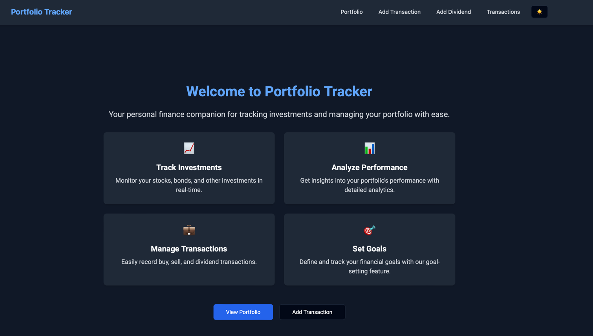

# Financial Portfolio Tracker

Welcome to the Financial Portfolio Tracker project! This project helps you track your investments in the stock market effectively. You can manage your portfolio, view transaction records, add new transactions, and more.

## Features

- **Portfolio Overview**: View a summary of your investment portfolio.
- **Transaction Records**: Check your transaction history, including details like time, stock code, stock price, and shares.
- **Add Transaction**: Record new transactions, such as stock purchases or deposits.
- **Search and Filter**: Filter transaction records by stock code and time range to find specific transactions quickly.
- **Monthly Portfolio Estimation**: Estimate your monthly investments in QQQ and TQQQ based on your total deposit. This feature allows you to visualize the potential growth of your portfolio over time with regular monthly investments.

## Technologies Used

- **Frontend**: Next.js, React.js, Tailwind CSS ([Frontend Repository](https://github.com/petertam888/finance-portfolio-application-ui))
- **Backend**: Spring Boot
- **API**: RESTful API for communication between frontend and backend
- **Database**: MySQL for storing user data and transaction records

